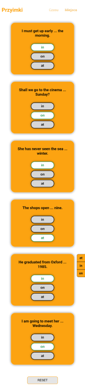

# REACT - PRACTICING ENGLISH ARTICLES
> This is my first aplication that I created in React.js
>
> The application works on the cloud platform [Netlify](https://www.netlify.com/)
>
> [Link to English Grammar Exercises](https://enexercisegrammar.netlify.app/)

## Table of contents
* [General info](#general-info)
* [Screenshots](#screenshots)
* [Technologies](#technologies)
* [Extends](#extends)
* [Status](#status)
* [Contact](#contact)

## General info
I created the application for training purposes after completing the cours about basis React.js.

## Screenshots

***

***

***

***

## Technologies
* CSS- version 3
* JavaScript

### Extends
* create-react-app
* CSS Modules + SCSS
* React Router
* Switch
* NavLink
* Context API

## Status
Project is: _finished_

## Contact
Created by [@Grzegorz Stącel](mailto:stacelgrzegorz@gmail.com) - feel free to contact me!
